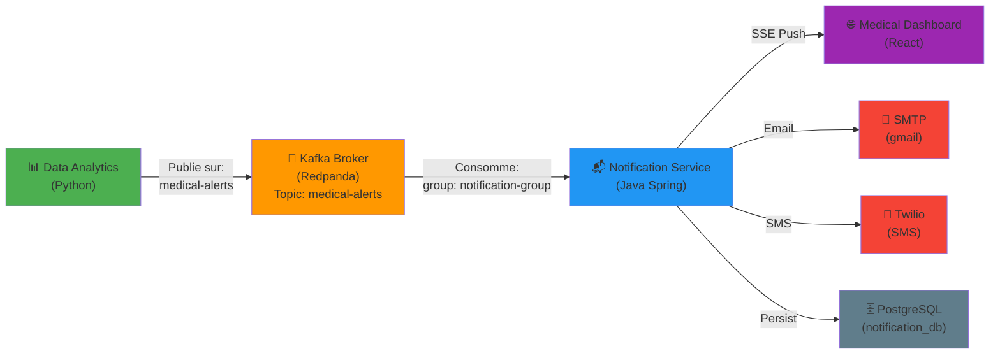
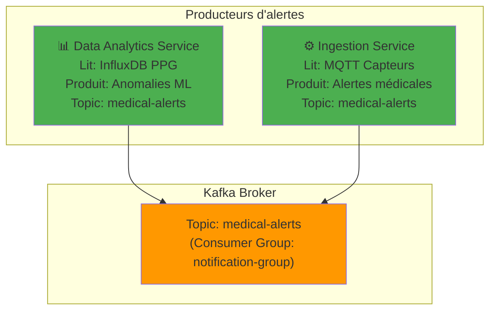
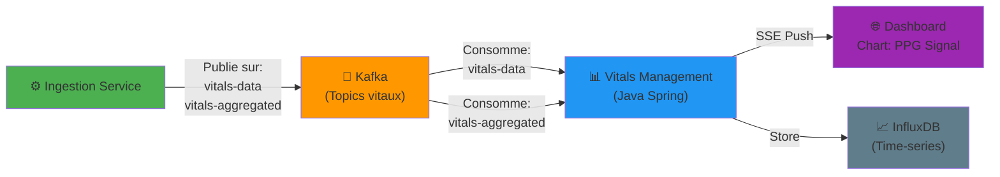

# Architecture - Pipeline des Notifications (Corrigé)
## Visualisation de flux de données

---

## 1. Flux complet de bout en bout



---

## 2. Sources des alertes (Tous les producteurs)



---

## 3. Flux de données vitales (séparé des alertes)



---

## 4. Pipeline complet multi-services

```
┌─────────────────────────────────────────────────────────────────────────────────────┐
│                          ARCHITECTURE PLATFORMEIOT                                  │
└─────────────────────────────────────────────────────────────────────────────────────┘

┌───────────────────────────────────────────────────────────────────────────────────┐
│                           STEP 1: INGESTION                                       │
├───────────────────────────────────────────────────────────────────────────────────┤
│                                                                                   │
│   📱 MQTT Capteurs              Smartwatch IoT                                   │
│   (Android SensorApp)     ───────────────→  PPG + Accéléromètre               │
│                                    ↓                                            │
│                          🌉 Mosquitto MQTT Broker                               │
│                          (port 1885)                                           │
│                                    ↓                                            │
│   ⚙️ ingestion-service   (lire MQTT, préprocesser)                            │
│       └─ Filtre les signaux                                                   │
│       └─ Détecte mouvements (thresholds)                                      │
│       └─ Agrège les données (fenêtres 30s)                                    │
│                                    ↓                                            │
│        Publie sur Kafka:  signals.raw                                         │
│                          signals.filtered                                     │
│                          vitals-aggregated ✅                                  │
│                          medical-alerts (si détecté)                          │
│                                                                                 │
└───────────────────────────────────────────────────────────────────────────────────┘

        ↓
        
┌───────────────────────────────────────────────────────────────────────────────────┐
│                           STEP 2: STOCKAGE & ENRICHISSEMENT                       │
├───────────────────────────────────────────────────────────────────────────────────┤
│                                                                                   │
│   🗄️ PostgreSQL              Stockage persistant (raw data)                      │
│   (ingestion_db)             Transactions, audit logs                           │
│                                    ↓                                            │
│   📈 InfluxDB               Time-series storage (métriques)                     │
│   (medical_data bucket)     ├─ PPG signals                                     │
│                             ├─ Heart rate                                      │
│                             └─ Activity levels                                 │
│                                                                                 │
│   📊 vitals-management      Enrichissement des données                          │
│   (Java Spring Boot)        ├─ Calcul HR, variabilité                         │
│   Port: 9090                ├─ Détection anomalies statistiques               │
│                             ├─ Normalisation                                   │
│                             └─ SSE broadcast aux clients                       │
│                                    ↓                                            │
│        Publie sur Kafka:  vitals-data   ✅                                     │
│                          vitals-aggregated ✅                                  │
│                                                                                 │
│   👨‍⚕️ Dashboard (Frontend)                                                       │
│   Port: 5173                Display PPG graphs en temps réel                   │
│                             (via SSE vitals-management)                        │
│                                                                                 │
└───────────────────────────────────────────────────────────────────────────────────┘

        ↓
        
┌───────────────────────────────────────────────────────────────────────────────────┐
│                           STEP 3: ANALYTICS & ALERTES                             │
├───────────────────────────────────────────────────────────────────────────────────┤
│                                                                                   │
│   📊 data-analytics-service  (Python ML Service)                                │
│   Container: data-analytics-service-pfa                                        │
│                                                                                 │
│       1. Lire InfluxDB (fenêtre PPG 30s)                                      │
│       2. Extraire 14 features PPG                                             │
│       3. Inference modèle XGBoost                                             │
│       4. Détecte anomalies cardiaques                                         │
│       5. Applique cooldown (5 min = 300s)                                     │
│                                    ↓                                            │
│        Publie sur Kafka:  medical-alerts ✅  ← CORRECTION APPLIQUÉE!          │
│                          (Topic centralisé pour alertes cliniques)            │
│                                                                                 │
│        Format de l'alerte:                                                     │
│        {                                                                        │
│          "alertId": "uuid",                                                     │
│          "patientId": "patient-001",                                           │
│          "alertType": "anomaly",                                              │
│          "severity": "WARNING|CRITICAL",                                      │
│          "detectionScore": 0.85,                                              │
│          "message": "Anomaly detected...",                                    │
│          "timestamp": "2025-04-20T14:30:00Z"                                 │
│        }                                                                        │
│                                                                                 │
└───────────────────────────────────────────────────────────────────────────────────┘

        ↓
        
┌───────────────────────────────────────────────────────────────────────────────────┐
│                           STEP 4: NOTIFICATION MULTI-CANAL                        │
├───────────────────────────────────────────────────────────────────────────────────┤
│                                                                                   │
│   📬 notification-service  (Java Spring Boot)                                   │
│   Port: 9095                                                                    │
│                                                                                 │
│       Consumer Kafka (AlertConsumer)                                           │
│       └─ Écoute: medical-alerts ✅ (CORRECTION APPLIQUÉE)                      │
│       └─ Groupe: notification-group                                            │
│                                    ↓                                            │
│       Dispatch selon severity:                                                 │
│                                                                                 │
│       ├─ INFO:      SSE uniquement                                            │
│       ├─ WARNING:   SSE + Email                                               │
│       ├─ CRITICAL:  SSE + Email + SMS                                         │
│                                    ↓                                            │
│       ┌──────────────────────────────────────┐                                │
│       │ Canaux de notification:              │                                │
│       │                                      │                                │
│       │ 🌐 SSE (Server-Sent Events)         │                                │
│       │    Endpoint: /api/notifications/    │                                │
│       │             stream/{patientId}      │                                │
│       │    → Temps réel browser (< 100ms)   │                                │
│       │                                      │                                │
│       │ 📧 Email (SMTP)                     │                                │
│       │    Config: spring.mail.host,        │                                │
│       │            spring.mail.username     │                                │
│       │    → Gmail, O365, custom SMTP       │                                │
│       │                                      │                                │
│       │ 📱 SMS (Twilio)                     │                                │
│       │    Config: twilio.account.sid,      │                                │
│       │            twilio.auth.token        │                                │
│       │    → Messages critiques urgents      │                                │
│       │                                      │                                │
│       └──────────────────────────────────────┘                                │
│                                    ↓                                            │
│       Persistence (PostgreSQL notification_db):                                │
│       └─ notification_logs                                                     │
│       └─ notification_recipients                                               │
│       └─ notification_delivery_events                                          │
│                                                                                 │
└───────────────────────────────────────────────────────────────────────────────────┘

        ↓
        
┌───────────────────────────────────────────────────────────────────────────────────┐
│                           STEP 5: AFFICHAGE TEMPS RÉEL                            │
├───────────────────────────────────────────────────────────────────────────────────┤
│                                                                                   │
│   👨‍⚕️ medical-dashboard  (React + Vite)                                          │
│   Port: 5173                                                                    │
│                                                                                 │
│       EventSource SSE:                                                         │
│       └─ Connexion: /api/notifications/stream/{patientId}                    │
│       └─ Reçoit alertes en temps réel                                        │
│       └─ Affichage:                                                           │
│          - Liste des 8 alertes récentes                                      │
│          - Code couleur: rouge=CRITICAL, orange=WARNING                     │
│          - Graphs PPG temps réel                                             │
│          - Statistiques vitales                                              │
│                                                                                 │
└───────────────────────────────────────────────────────────────────────────────────┘
```

---

## 5. Séquence temporelle d'une alerte

```
Timeline (ms)  Event
──────────────────────────────────────────────────────────────
    0ms        📱 Capteur collecte PPG (timestamp)
                │
   100ms       ⚙️ ingestion-service reçoit MQTT
                │ - Filtre bruit
                │ - Prétraitement
                │
   200ms       📈 InfluxDB reçoit données
                │ - Time-series write
                │
   500ms       📊 data-analytics-service poll InfluxDB
                │ - Extraction features
                │ - Inference ML
                │ - Décision: anomaly?
                │
   600ms       🔄 Kafka: publish medical-alerts
                │
   610ms       📬 notification-service consomme
                │ - Parse Alert JSON
                │ - Lookup recipients
                │ - Dispatch channels
                │
   612ms       🌐 SSE: send to browser
                │
   650ms       👨‍⚕️ Dashboard reçoit alerte
                │ - React state update
                │ - List refresh
                │
   680ms       ✅ VISIBLE À L'UTILISATEUR
                │
               ↓ (Parallèle)
               
   700ms       📧 Email: send async
                │
   2000ms      📧 Email: reçu par docteur
                │
   800ms       📱 SMS: send async
                │
   1500ms      📱 SMS: reçu sur téléphone
```

**Délai total**: ~650ms pour apparaître au dashboard ✅

---

## 6. Topics Kafka - Responsabilités

```
┌─────────────────────────────────────────────────────────────────┐
│                    KAFKA BROKER (Redpanda)                      │
├─────────────────────────────────────────────────────────────────┤
│                                                                 │
│  Topic: medical-alerts  ⭐ PRINCIPAL                           │
│  ├─ Producteurs:   data-analytics-service                     │
│  │               ingestion-service (si alerte)                │
│  ├─ Consommateurs: notification-service                       │
│  ├─ Retention:    7 jours                                     │
│  └─ Partitions:   1 (garantit ordre par patientId)            │
│                                                                 │
│  Topic: vitals-data  ⭐ DONNÉES VITALES                        │
│  ├─ Producteur:   ingestion-service (PPG brut)                │
│  ├─ Consommateurs: vitals-management                          │
│  ├─ Retention:    1 jour (données brutes volumineuses)        │
│  └─ Partitions:   3 (scalabilité)                             │
│                                                                 │
│  Topic: vitals-aggregated  ⭐ DONNÉES ENRICHIES               │
│  ├─ Producteur:   ingestion-service (agrégé 30s)              │
│  ├─ Consommateurs: vitals-management                          │
│  ├─ Retention:    30 jours (utile pour analytics)             │
│  └─ Partitions:   1 (ordre important)                         │
│                                                                 │
│  Topic: signals.raw  (LEGACY - déprecié)                      │
│  ├─ Producteur:   ingestion-service                           │
│  ├─ Consommateurs: AUCUN                                      │
│  └─ Note: Garder pour backward compat, puis supprimer        │
│                                                                 │
│  Topic: signals.filtered  (LEGACY - déprecié)                 │
│  ├─ Producteur:   ingestion-service                           │
│  ├─ Consommateurs: AUCUN                                      │
│  └─ Note: Garder pour backward compat, puis supprimer        │
│                                                                 │
└─────────────────────────────────────────────────────────────────┘
```

---

## 7. Sécurité du flux (API Gateway)

```
┌──────────────────────────────────────────────────────────────┐
│            API Gateway (Spring Cloud Gateway)                │
│            Port: 8080                                        │
├──────────────────────────────────────────────────────────────┤
│                                                              │
│  Routes:                                                     │
│                                                              │
│  /api/vitals/**      → vitals-management:9090    [Public]   │
│  /api/notifications/**  → notification-service:9095  [Auth]  │
│  /api/ingestion/**   → ingestion-service:8081    [Auth]     │
│  /health             → Actuator (healthcheck)    [Public]   │
│                                                              │
│  Authentification:                                           │
│  ├─ JWT token (Keycloak OAuth2)                 │
│  ├─ Validation via /realms/iot-sante/.../certs   │
│  └─ Roles-based access control                   │
│                                                              │
│  Middleware:                                                 │
│  ├─ Rate limiting                                          │
│  ├─ Logging                                                │
│  └─ CORS (medical-dashboard: 5173)               │
│                                                              │
└──────────────────────────────────────────────────────────────┘
```

---

## 8. Résumé des corrections

| Composant | Avant | Après | Impact |
|-----------|-------|-------|--------|
| **data-analytics topic** | `alerts` ❌ | `medical-alerts` ✅ | Alertes ML maintenant reçues |
| **vitals-management listeners** | 3 topics confus | 2 topics clairs ✅ | Séparation alertes/vitaux |
| **ingestion-service topic** | `signals.aggregated` | `vitals-aggregated` ✅ | Cohérence nomenclature |
| **notification-service** | OK | OK (pas changé) ✅ | Fonctionne mieux |
| **docker-compose** | Partiel | Vars d'env complètes ✅ | Production-ready |

---

## ✅ Validation

Pipeline est **OPÉRATIONNEL** quand:
- ✅ data-analytics-service container lancé
- ✅ Kafka topics existent et actifs
- ✅ notification-service reçoit messages
- ✅ SSE connecté au browser
- ✅ Dashboard affiche alertes < 1s

Voir: [GUIDE_VERIFICATION_NOTIFICATIONS.md](GUIDE_VERIFICATION_NOTIFICATIONS.md)
